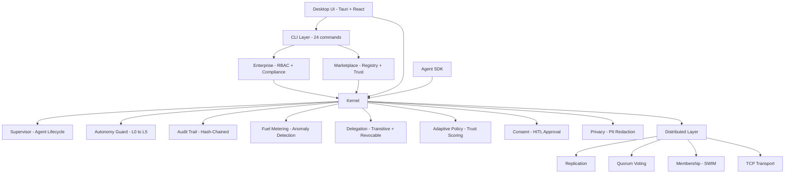

[](https://github.com/nexai-lang/nexus-os/actions/workflows/ci.yml)
[](CHANGELOG.md)
[](LICENSE)

# Nexus OS

**Governed AI Agent Operating System**

> Don't trust. Verify.

Nexus OS is a Rust-based operating system for AI agents where every action passes through capability checks, fuel metering, and cryptographic audit trails. Agents don't get trust by default -- they earn it through track records, and lose it through violations.

## Feature Matrix

| Category | Feature | Status |
|----------|---------|--------|
| **Governance** | Capability-based access control | Stable |
| **Governance** | 6-level autonomy system (L0-L5) | Stable |
| **Governance** | Fuel metering with anomaly detection | Stable |
| **Governance** | Human-in-the-loop approval gates | Stable |
| **Governance** | Adaptive trust scoring + auto-promotion/demotion | Stable |
| **Governance** | Transitive delegation with cascade revocation | Stable |
| **Audit** | Hash-chained append-only audit trail | Stable |
| **Audit** | Deterministic replay with evidence bundles | Stable |
| **Audit** | PII redaction at LLM gateway boundary | Stable |
| **Distributed** | TCP transport with length-prefix framing | Stable |
| **Distributed** | Audit replication across nodes | Stable |
| **Distributed** | Quorum-based governance voting | Stable |
| **Distributed** | SWIM-style membership protocol | Stable |
| **Enterprise** | Role-based access control (RBAC) | Stable |
| **Enterprise** | SOC 2 Type II compliance reporting | Stable |
| **Marketplace** | Signed agent bundles with trust scoring | Stable |
| **Marketplace** | Security scanning + manifest verification | Stable |
| **Desktop** | Tauri shell with 9 interactive pages | Stable |
| **CLI** | 24 commands across 8 subsystems | Stable |
| **Safety** | Kill gates for emergency shutdown | Stable |
| **Safety** | Zero unsafe Rust (`unsafe_code = "forbid"`) | Enforced |

## Architecture



## Quickstart

### Prerequisites

- Rust 1.75+ stable toolchain
- Node.js 20+ and npm
- Platform dependencies for Tauri (see CI workflow for Linux packages)

### Build and Verify

```bash
git clone https://github.com/nexai-lang/nexus-os.git
cd nexus-os

# Build and test
cargo fmt --all -- --check
cargo clippy --workspace --all-targets --all-features -- -D warnings
cargo test --workspace --all-features

# Build desktop UI
cd app && npm ci && npm run build
```

### Run Desktop Shell

```bash
cd app
npm run tauri dev
```

### CLI Usage

```bash
# Agent management
nexus agent list
nexus agent start --id my-agent
nexus agent status --id my-agent

# Audit verification
nexus audit verify
nexus audit show

# Cluster operations
nexus cluster status
nexus cluster join --seed 10.0.1.10:9090

# Marketplace
nexus marketplace search "code generator"
nexus marketplace install agent-coder

# Compliance
nexus compliance report
nexus compliance status
```

## Workspace Crates

| Crate | Purpose |
|-------|---------|
| `kernel` | Core governance runtime -- capability checks, fuel, audit, autonomy |
| `sdk` | Agent development SDK -- NexusAgent trait, AgentContext, TestHarness |
| `distributed` | Cross-node networking -- TCP transport, replication, quorum, membership |
| `enterprise` | RBAC and SOC 2 compliance reporting |
| `marketplace` | Agent package registry, trust scoring, security scanning |
| `cli` | 24-command CLI covering all subsystems |
| `app` | Tauri desktop shell with React/TypeScript frontend |
| `connectors/*` | External service connectors (web, social, messaging, LLM) |
| `agents/*` | 9 built-in agents (coder, designer, web-builder, etc.) |
| `benchmarks` | Performance benchmark suite |

## Documentation

| Document | Description |
|----------|-------------|
| [Architecture Guide](docs/ARCHITECTURE.md) | Layered system design, module reference, governance pipeline |
| [SDK Tutorial](docs/SDK_TUTORIAL.md) | Build your first governed agent step-by-step |
| [Deployment Guide](docs/DEPLOYMENT.md) | Single node and cluster setup, configuration reference |
| [Security Hardening](docs/SECURITY_HARDENING.md) | Production hardening checklist with verification commands |
| [API Reference](docs/API_REFERENCE.md) | Complete public type and function reference |
| [User Guide](docs/USER_GUIDE.md) | End-user guide for the desktop application |
| [Developer Guide](docs/DEVELOPER_GUIDE.md) | Contributing and development workflow |
| [Threat Model](docs/THREAT_MODEL.md) | Attack surfaces and mitigations |
| [Performance](docs/PERFORMANCE.md) | Benchmark results and optimization notes |

## Security Invariants

These are enforced at the code level and must never be violated:

1. Every agent action goes through kernel capability checks
2. Fuel budget checked **before** execution, not after
3. Audit trail is append-only with hash-chain integrity
4. PII redaction at LLM gateway boundary
5. HITL approval mandatory for Tier 1+ operations
6. `unsafe_code = "forbid"` -- zero unsafe Rust
7. All tests must pass before merging
8. Agents declare capabilities in TOML manifests

## Built By

Created by Devil -- a self-taught developer who built an entire governed agent operating system from scratch.

## License

This project is licensed under the MIT License. See [LICENSE](LICENSE).
